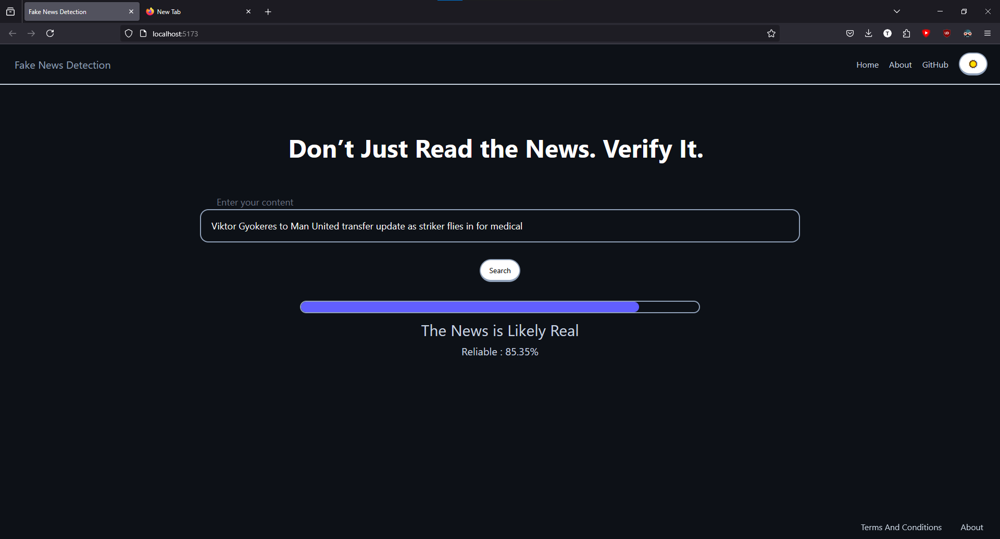

# 🔍 Fake News Detection System

[](https://opensource.org/licenses/MIT)
[](https://www.python.org/)
[](https://fastapi.tiangolo.com/)
[](https://reactjs.org/)
[](https://huggingface.co/bert-base-uncased)

A modern web application leveraging deep learning to detect fake news from legitimate content with up to 90% accuracy.

<p align="center">
  <video src="https://github.com/user-attachments/assets/dfb7fa8a-0dc5-4cff-a776-17f2a318ebae" controls width="600">Your browser doesn't support the video tag</video>
  
</p>

## 📋 Table of Contents

- [Overview](#-overview)
- [Features](#-features)
- [Tech Stack](#-tech-stack)
- [Project Structure](#-project-structure)
- [Installation](#-installation)
- [Usage](#-usage)
- [API Documentation](#-api-documentation)
- [Model Architecture](#-model-architecture)
- [Performance](#-performance)
- [Future Work](#-future-work)
- [Contributing](#-contributing)
- [License](#-license)

## 🌟 Overview

This project implements a Fake News Detection System using a fine-tuned BERT architecture. The system analyzes news content and classifies it as either legitimate or fake news with high accuracy, helping users identify misinformation in digital content.

## ✨ Features

- **High Accuracy Detection**: Custom BERT model with 90% classification accuracy
- **User-Friendly Interface**: Modern React frontend
- **API Integration**: Well-documented FastAPI backend for easy integration
- **Reproducible Research**: Complete Jupyter notebook with model training process

## 🛠️ Tech Stack

### Backend
- **Model**: Custom BERT architecture based on `bert-base-uncased` from Huggingface
- **Framework**: FastAPI
- **Language**: Python 3.8+
- **ML Libraries**: PyTorch, Transformers, Scikit-learn

### Frontend
- **Framework**: React 18+ with Vite
- **UI Components**: Shadcn UI
- **Styling**: Tailwind CSS
- **HTTP Client**: Axios
- **State Management**: React Context API

### Development & Deployment
- **Version Control**: Git
<!-- - **Containerization**: Docker -->
- **Documentation**: Jupyter Notebooks
- **Package Management**: npm, pip

## 📁 Project Structure

```
fake-news-detection/
├── README.md                             # Project documentation
├── LICENSE                               # Project License
├── backend/                              # FastAPI server
│   ├── app.py                            # API entry point
│   ├── model_download_helper.py          # Script to automatically download model files from cloud storage
│   ├── notebook/                         # Jupyter Notebook
│   ├── models/                           # ML model definitions
│   └── requirements.txt                  # Python dependencies
├── images/                               # Project Screenshots
│   └── screenshot.jpeg                   # UI Preview
└── frontend/                             # Vite-React application
    ├── src/
    │   ├── components/                   # UI components
    │   ├── pages/                        # Application pages
    │   ├── ui/                           # ShadCN UI
    │   ├── context/                      # React Context for Manual Theme Switching
    │   ├── lib/                          # TW Library
    │   ├── App.jsx                       # Application
    │   ├── App.css                       # Application CSS
    │   ├── index.css                     # Main CSS file
    │   └── main.jsx                      # Main React Component
    ├── package.json                      # JS dependencies
    └── tailwind.config.js                # Tailwind configuration
```

## 🚀 Installation

### Prerequisites
- Python 3.8+
- Node.js 16+
- npm or yarn
- Git

### Clone the Repository
```bash
git clone https://github.com/ItsTSH/Fake-News-Detection-System
cd fake-news-detection-system
```

### Backend Setup
```bash
cd backend
python -m venv venv
source venv/bin/activate  # On Windows: venv\Scripts\activate
pip install -r requirements.txt
```

### Frontend Setup
```bash
cd frontend
npm install  # or yarn install
```

<!-- ### Using Docker
```bash
docker-compose up -d
``` -->

## 💻 Usage

### Start the Backend Server
```bash
cd backend
uvicorn app.main:app --reload
```

### Start the Frontend Development Server
```bash
cd frontend
npm run dev  # or yarn dev
```

Access the application at `http://localhost:5173`

### Main Endpoint

| Endpoint | Method | Description |
|----------|--------|-------------|
| `/predict` | POST | Submit text for fake news analysis |

## 🧠 Model Architecture

The fake news detection model is based on the BERT base architecture from Huggingface with the following modifications:

1. **Pre-trained Base**: `bert-base-uncased` from Huggingface
2. **Layer Freezing**: Most BERT layers are frozen during training for transfer learning efficiency
3. **Custom Classification Head**: Additional layers for the specific task of fake news detection
4. **Hyperparameter Tuning**: Optimized learning rate, batch size, and training epochs

For detailed architecture and training process, refer to the Jupyter notebook in the `model/notebooks/` directory.

## 📊 Performance

- **Accuracy**: upto 90% on test dataset
- **F1 Score**: 0.86
- **Precision**: 0.91
- **Recall**: 0.91

## 🗃️ Dataset

- Dataset Used: Kaggle: [fake-and-real-news-dataset](https://www.kaggle.com/datasets/clmentbisaillon/fake-and-real-news-dataset)

## 👥 Contributing

Contributions are welcome! Please feel free to submit a Pull Request.

1. Fork the repository
2. Create your feature branch (`git checkout -b feature/amazing-feature`)
3. Commit your changes (`git commit -m 'Add some amazing feature'`)
4. Push to the branch (`git push origin feature/amazing-feature`)
5. Open a Pull Request

## 📄 License

This project is licensed under the MIT License - see the LICENSE file for details.

---
<p align="center">
   ⭐ If you find this project helpful, please consider starring the repository! 🌟
 </p>
 <br>
<p align="center">
  Made with ❤️ by <a href="https://github.com/ItsTSH">Tejinder Singh Hunjan</a>
</p>
